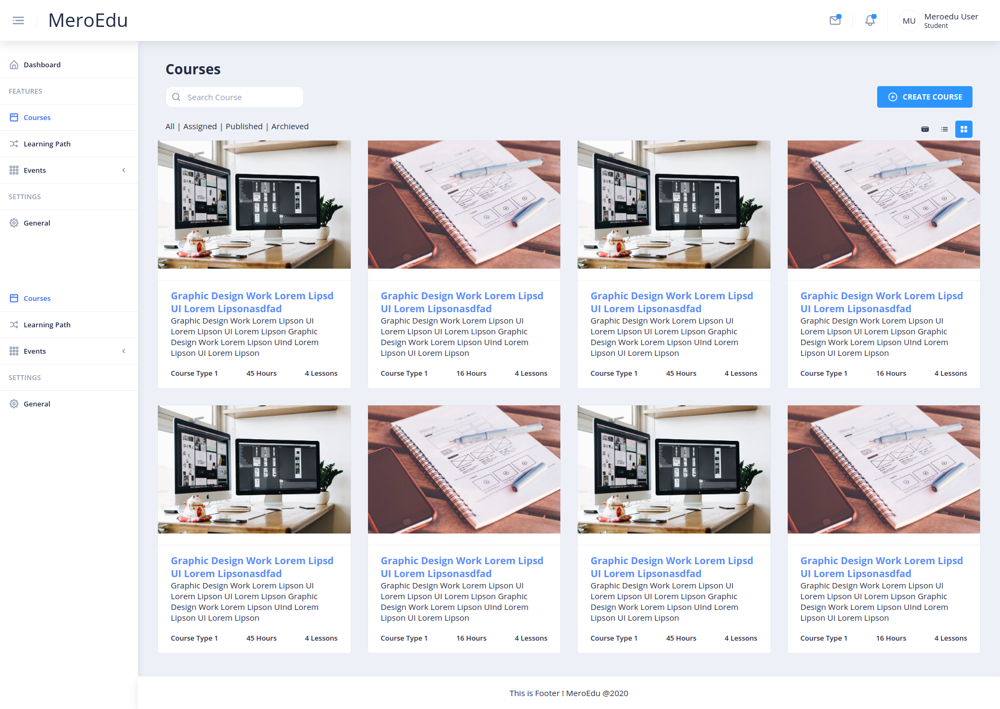

###  Meroedu-UI based on Angular 10+

|  |
| --- |
|  MeroEdu |

### Demo

<a target="_blank" href="http://#">Live Demo</a>

## Documentation
#### Overview:  
This project was generated with [Angular CLI](https://github.com/angular/angular-cli) version 10.0.8.
- Uses [Ngx-admin](https://github.com/akveo/ngx-admin) modules set,

##### included:

- Angular 10+ & Typescript
- Bootstrap 4+ & SCSS
- Responsive layout
- High resolution
- Flexibly configurable themes with **hot-reload**
- 40+ Angular Components

####  Development server:  
Run `ng serve` for a dev server. Navigate to `http://localhost:4200/`. The app will automatically reload if you change any of the source files.

#### Code scaffolding:  
Run `ng generate component component-name` to generate a new component. You can also use `ng generate directive|pipe|service|class|guard|interface|enum|module`.  

To get more help on the Angular CLI use `ng help` or go check out the [Angular CLI README](https://github.com/angular/angular-cli/blob/master/README.md).

### How can I support developers?
- Create pull requests, submit bugs, suggest new features or documentation updates :wrench:
- Get in touch with developers or **meroedu** team members :thumbsup:
  
  
